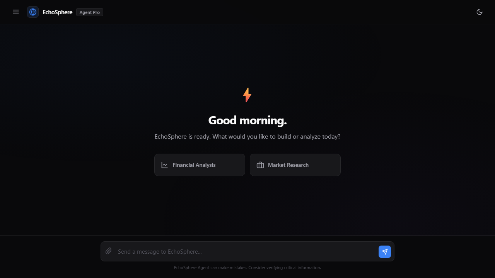
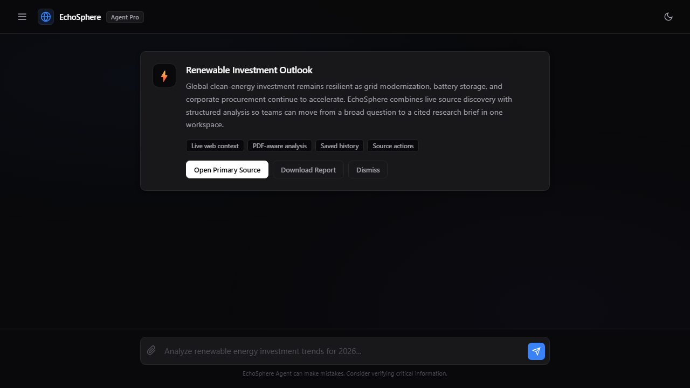
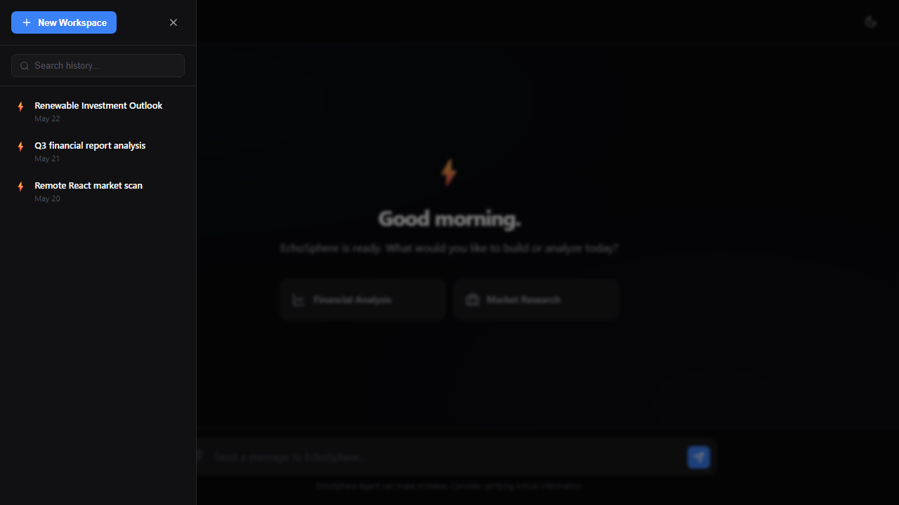

# EchoSphere

EchoSphere is an AI research workspace for turning web searches and uploaded PDFs into structured analysis reports. It combines live web discovery, deep page scraping, Groq-powered response generation, MongoDB-backed history, and a protected admin view.

## Screenshots







## Features

- AI research reports generated from live Tavily search results and Groq chat completions.
- Deep scraping for top web results with private-network URL safeguards.
- PDF upload support with in-memory parsing.
- Private research history stored per signed-in account or anonymous browser session.
- Optional Clerk accounts with sign-in, sign-up, and Google authentication support.
- Basic-auth protected admin history dashboard.
- Dark and light theme support with responsive layout.

## Tech Stack

- Node.js and Express
- MongoDB with Mongoose
- Groq SDK
- Tavily Search API
- Multer and pdf-parse for PDF uploads
- Vanilla HTML, CSS, and JavaScript

## Getting Started

```bash
git clone https://github.com/amenallah5577/EchoSphere.git
cd EchoSphere
npm install
cp .env.example .env
npm run check
npm start
```

The app runs at `http://localhost:3000` by default.

## Environment Variables

Copy `.env.example` to `.env`, then fill in:

| Variable | Purpose |
| --- | --- |
| `MONGODB_URI` | MongoDB connection string for saved report history. |
| `GROQ_API_KEY` | Groq API key for report generation. |
| `TAVILY_API_KEY` | Tavily API key for live web search. |
| `SESSION_SECRET` | Long random secret used to sign anonymous browser sessions. |
| `CLERK_SECRET_KEY` | Optional Clerk backend key. Enable together with `CLERK_PUBLISHABLE_KEY`. |
| `CLERK_PUBLISHABLE_KEY` | Optional Clerk frontend key. Enable together with `CLERK_SECRET_KEY`. |
| `ADMIN_USERNAME` | Username for the admin history dashboard. |
| `ADMIN_PASSWORD` | Password for the admin history dashboard. |

## API Overview

| Route | Method | Description |
| --- | --- | --- |
| `/api/config` | `GET` | Returns optional account configuration for the browser client. |
| `/api/profile` | `GET` | Establishes a private guest session or returns account mode. |
| `/api/dispatch` | `POST` | Runs a research task, optionally with an uploaded PDF. |
| `/api/history` | `GET` | Returns recent history for the current account or guest session. |
| `/api/admin/history` | `GET` | Returns recent research history for the admin dashboard. Requires basic auth. |
| `/admin.html` | `GET` | Protected admin dashboard for reviewing saved reports. |

## Quality Checks

```bash
npm run check
npm audit
```

`npm run check` validates the server syntax. `npm audit` is useful before releases because upstream provider SDK advisories can change over time.

## Optional Clerk Accounts

EchoSphere works normally without login. To enable accounts, create a Clerk
application and add both Clerk keys to the Render environment. For Google
authentication, add a Google social connection for all users in the Clerk
Dashboard. Production Google OAuth also requires custom Google client
credentials and the authorized redirect URI provided by Clerk.

## Project Structure

```text
.
|-- public/
|   |-- admin.html
|   |-- app.js
|   |-- index.html
|   `-- styles.css
|-- docs/
|   `-- screenshots/
|-- server.js
|-- package.json
`-- .env.example
```
